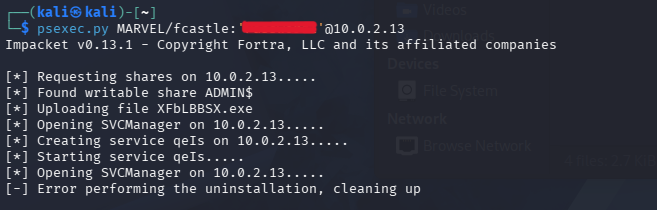
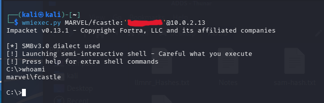
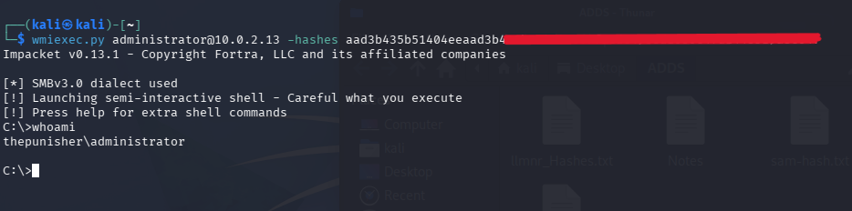
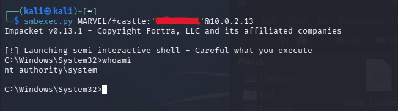
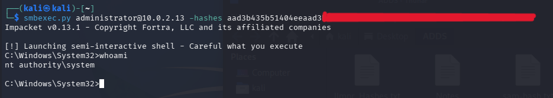

# Gaining Shell Access

## Executive Summary

This lab focused on gaining remote shell access to a Windows domain workstation after obtaining valid credentials or hashes. Three Impacket tools were tested: `psexec.py`, `wmiexec.py`, and `smbexec.py`.

`psexec.py` successfully authenticated and reached the service creation stage, but it failed during cleanup. In this lab, Microsoft Defender confirmed the detection by showing an alert on the target system and quarantining and removing the uploaded PsExec-style service binary. `wmiexec.py` and `smbexec.py` both worked successfully with a plaintext password and with NTLM hashes.

## Lab Environment

| Role | System | VM Name | Observed Details |
|---|---|---|---|
| Attacker | Kali Linux 2026.1 | kali-linux-2026.1-virtualbox-amd64 | Impacket tools |
| Target Workstation | Windows 11 | THEPUNISHER | Target IP `10.0.2.13` |
| Domain | Active Directory | MARVEL | Domain user and administrator contexts tested |

Sensitive passwords and hash values are intentionally redacted from the screenshots and are not included in this report.

## Tools Used

- Impacket `psexec.py`
- Impacket `wmiexec.py`
- Impacket `smbexec.py`

## Attack Background

Remote shell access can be obtained when an attacker has valid domain or local credentials with sufficient permissions on a target host. Impacket provides multiple tools for this type of remote execution. Each tool uses a different execution method, which can affect reliability and detection.

The key difference observed in this lab was that `psexec.py` drops a service executable to disk and creates a Windows service. Microsoft Defender commonly detects this behavior because it resembles known PsExec-style attacker activity.

## Methodology

### Step 1: Attempt Shell Access with psexec.py

`psexec.py` was tested against the target workstation:

```bash
psexec.py MARVEL/fcastle:<REDACTED>@10.0.2.13
```

The tool successfully authenticated, found a writable `ADMIN$` share, uploaded an executable, opened the Service Control Manager, created a service, and started it. The attack then failed during cleanup.

Evidence:



Observed behavior:

- Authentication succeeded.
- A writable `ADMIN$` share was found.
- A service executable was uploaded.
- A service was created and started.
- Cleanup and uninstallation failed.

### Step 2: Gain Shell Access with wmiexec.py Using a Password

`wmiexec.py` was tested with a plaintext password:

```bash
wmiexec.py MARVEL/fcastle:<REDACTED>@10.0.2.13
```

The tool launched a semi-interactive shell and successfully executed `whoami`.

Evidence:



Result:

```text
marvel\fcastle
```

### Step 3: Gain Shell Access with wmiexec.py Using a Hash

`wmiexec.py` was also tested with NTLM hashes:

```bash
wmiexec.py administrator@10.0.2.13 -hashes <LM_HASH>:<NT_HASH>
```

The tool launched a semi-interactive shell and successfully executed `whoami`.

Evidence:



Result:

```text
thepunisher\administrator
```

### Step 4: Gain Shell Access with smbexec.py Using a Password

`smbexec.py` was tested with a plaintext password:

```bash
smbexec.py MARVEL/fcastle:<REDACTED>@10.0.2.13
```

The tool launched a semi-interactive shell and successfully executed `whoami`.

Evidence:



Result:

```text
nt authority\system
```

### Step 5: Gain Shell Access with smbexec.py Using a Hash

`smbexec.py` was also tested with NTLM hashes:

```bash
smbexec.py administrator@10.0.2.13 -hashes <LM_HASH>:<NT_HASH>
```

The tool launched a semi-interactive shell and successfully executed `whoami`.

Evidence:



Result:

```text
nt authority\system
```

## Result

The shell access lab was successful.

Key outcomes:

- `psexec.py` authenticated and created a service, but failed during cleanup.
- `wmiexec.py` worked with a plaintext password.
- `wmiexec.py` worked with NTLM hashes.
- `smbexec.py` worked with a plaintext password.
- `smbexec.py` worked with NTLM hashes.
- `smbexec.py` returned a shell running as `nt authority\system`.

## Why psexec.py Failed

`psexec.py` failed because Microsoft Defender detected the uploaded PsExec-style executable on the target system. The target displayed a Defender notification, and the detection was confirmed in Windows Security protection history. Defender quarantined and removed the uploaded executable, which prevented the tool from completing cleanly.

`psexec.py` commonly uploads a service executable to the target and creates a Windows service to execute commands. This behavior is noisy and is often detected by Microsoft Defender because it matches common PsExec-style lateral movement tradecraft.

In the screenshot, `psexec.py` reached the following stages:

- Authenticated to the target.
- Found writable shares.
- Uploaded an executable.
- Opened the Service Control Manager.
- Created and started a service.
- Failed during cleanup and uninstallation.

In this lab, the failure happened because Defender quarantined and removed the uploaded executable before Impacket could finish execution and cleanup.

## Why wmiexec.py and smbexec.py Worked

### wmiexec.py

`wmiexec.py` uses Windows Management Instrumentation to execute commands remotely. It usually does not need to upload the same PsExec-style service binary to disk, which can make it less likely to trigger Defender in a basic lab configuration.

### smbexec.py

`smbexec.py` also uses service-based execution, but its behavior and payload path can differ from `psexec.py`. In this lab, it was not blocked and successfully provided a shell as `nt authority\system`.

## Comparison

| Method | Drops File | Creates Service | Lab Result | Defender Attention |
|---|---|---|---|---|
| `wmiexec.py` | No | No | Worked with password and hash | Lower |
| `smbexec.py` | Usually | Yes | Worked with password and hash | Medium |
| `psexec.py` | Yes | Yes | Authenticated, then failed during cleanup | Higher |

## Detection and Verification Notes

Microsoft Defender detection was confirmed on the target host by reviewing Windows Security protection history around the time of execution.

PowerShell commands that can help validate Defender activity:

```powershell
Get-MpThreatDetection
```

```powershell
Get-WinEvent -LogName "Microsoft-Windows-Windows Defender/Operational"
```

To check whether the temporary service still exists:

```cmd
sc query <SERVICE_NAME>
```

```cmd
sc qc <SERVICE_NAME>
```

## Lessons Learned

This lab showed that successful authentication does not always mean successful shell access. Tool behavior matters. `psexec.py` can be blocked because it writes an executable and creates a service, while `wmiexec.py` and `smbexec.py` may succeed depending on endpoint protection and target configuration.

The main takeaway is that different lateral movement techniques have different operational behavior, detection profiles, and reliability. Testing multiple methods in a lab helps explain why one tool fails while another works with the same credential material.

## References

- Impacket `psexec.py`
- Impacket `wmiexec.py`
- Impacket `smbexec.py`
- Microsoft Defender event logs
