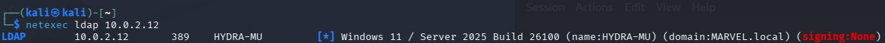
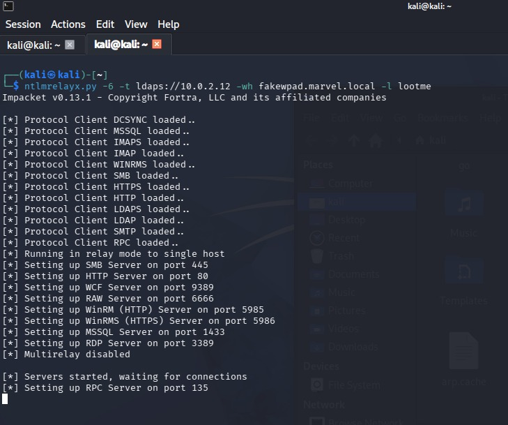
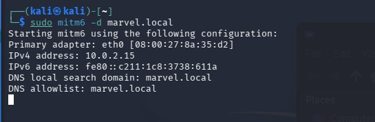
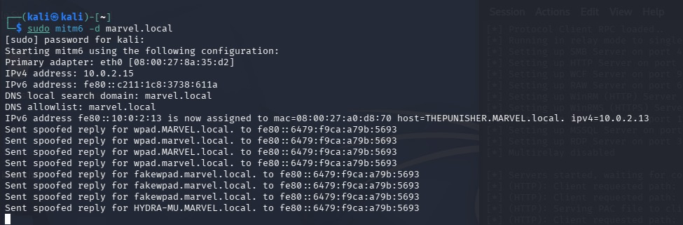
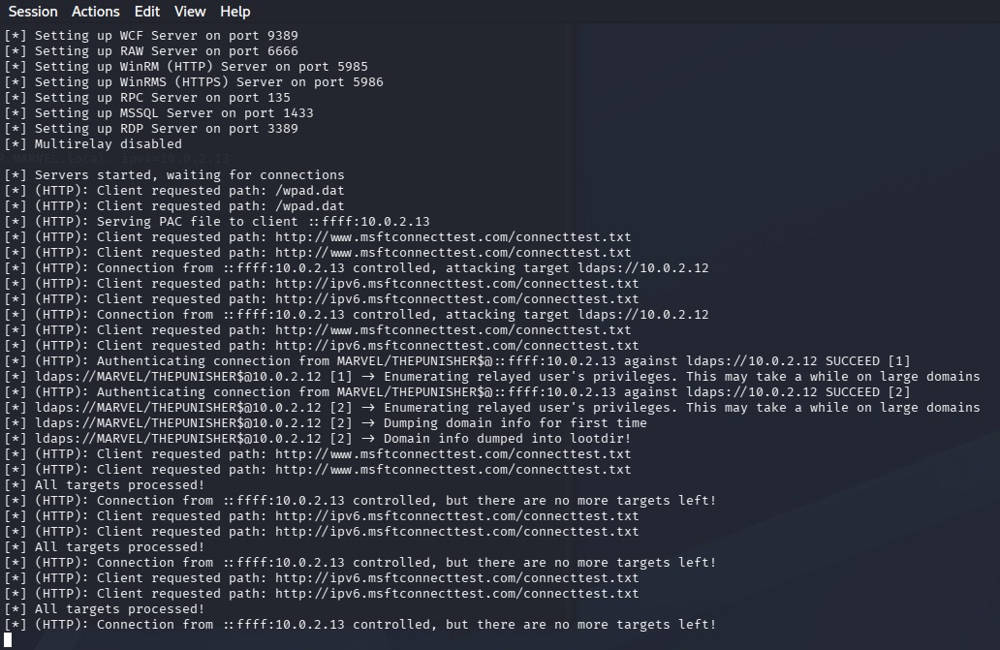
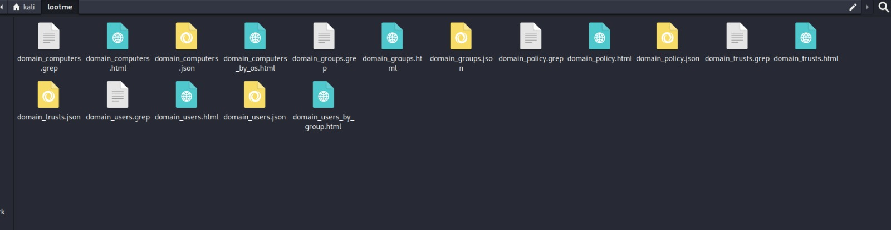
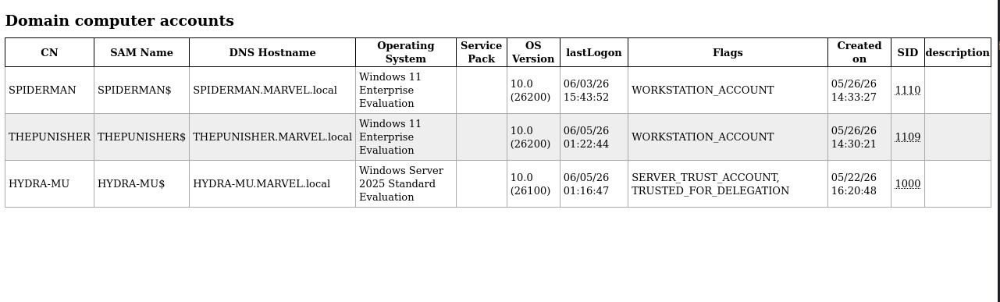
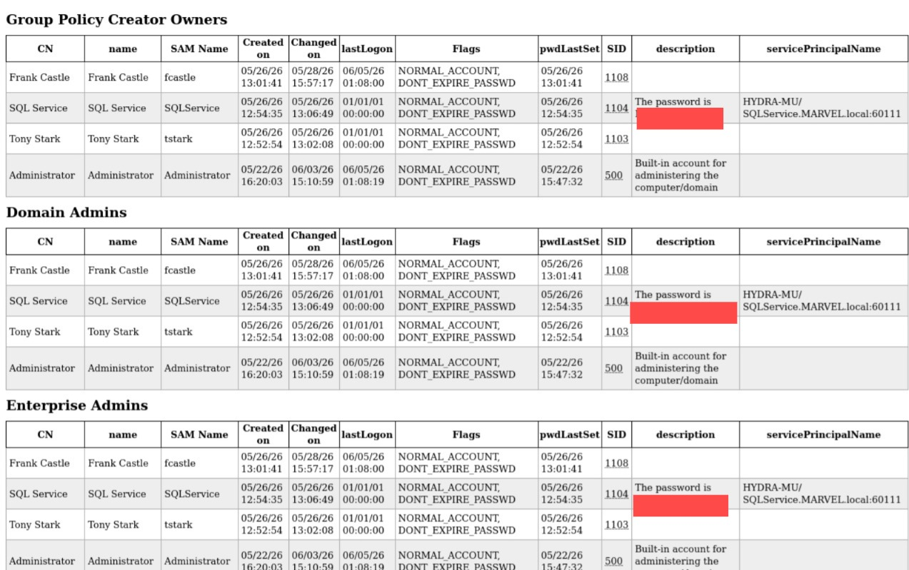
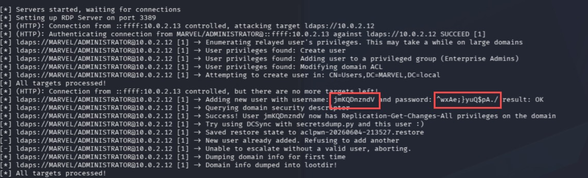
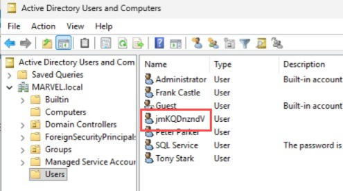

# IPv6 DNS Takeover via mitm6

## Executive Summary

This lab focused on abusing default IPv6 behavior in a Windows Active Directory environment using `mitm6`. The attacker machine responded to IPv6 DNS and WPAD-related requests, causing the target workstation to use the attacker-controlled system for name resolution and proxy discovery. The captured authentication was then relayed with Impacket `ntlmrelayx.py` to LDAPS on the domain controller.

The first event occurred after rebooting `THEPUNISHER`, which triggered IPv6 and WPAD traffic. This allowed `ntlmrelayx.py` to authenticate to LDAPS and dump LDAP domain information into a `lootme` folder. A later event occurred when `MARVEL\administrator` logged in on the target computer. That higher-privileged authentication allowed `ntlmrelayx.py` to create a new domain user, which was verified in Active Directory Users and Computers on the domain controller.

## Lab Environment

| Role | System | VM Name | Observed Details |
|---|---|---|---|
| Attacker | Kali Linux 2026.1 | kali-linux-2026.1-virtualbox-amd64 | `mitm6`, NetExec, Impacket |
| Domain Controller | Windows Server | HYDRA-MU | LDAP/LDAPS target at `10.0.2.12` |
| Target Workstation | Windows 11 | THEPUNISHER | Target at `10.0.2.13` |
| Domain | Active Directory | MARVEL.local | Domain used for relay testing |

Sensitive passwords and hash material are intentionally not included in this report.

## Tools Used

- NetExec
- mitm6
- Impacket `ntlmrelayx.py`
- Active Directory Users and Computers

## Attack Background

Windows networks often have IPv6 enabled by default, even when the organization does not actively use IPv6. `mitm6` abuses this by replying to IPv6 DHCP and DNS requests and positioning the attacker as a DNS server for the victim. When Windows systems request WPAD or other network resources, authentication can be triggered and relayed.

When LDAP signing and channel binding are not properly enforced, NTLM authentication can be relayed to LDAP or LDAPS. Depending on the privileges of the relayed account, an attacker may be able to dump domain information or modify Active Directory objects.

## Conditions Required

This attack is possible when:

- IPv6 is enabled on Windows systems.
- Clients accept attacker-provided IPv6 DNS or WPAD responses.
- NTLM authentication is allowed.
- LDAP signing or related protections are not fully enforced.
- The relayed account has permissions that allow useful LDAP actions.

## Methodology

### Step 1: Check LDAP Signing with NetExec

NetExec was used to check LDAP signing on the domain controller:

```bash
netexec ldap 10.0.2.12
```

The output identified the host as `HYDRA-MU` in the `MARVEL.local` domain and showed LDAP signing as `None`.

Evidence:



### Step 2: Start ntlmrelayx.py

Impacket `ntlmrelayx.py` was configured to relay captured authentication to LDAPS on the domain controller:

```bash
ntlmrelayx.py -6 -t ldaps://10.0.2.12 -wh fakewpad.marvel.local -l lootme
```

Command option summary:

| Option | Purpose |
|---|---|
| `-6` | Enables IPv6 support |
| `-t ldaps://10.0.2.12` | Sets the LDAPS relay target |
| `-wh fakewpad.marvel.local` | Sets the WPAD host used during the attack |
| `-l lootme` | Stores LDAP dump output in the `lootme` folder |

Evidence:



### Step 3: Start mitm6

`mitm6` was started for the `marvel.local` domain:

```bash
sudo mitm6 -d marvel.local
```

The tool showed the attacker interface, IPv4 address, IPv6 address, local search domain, and DNS allowlist.

Evidence:



### Step 4: Trigger an Event from THEPUNISHER

After the tools were running, the target workstation `THEPUNISHER` was rebooted. The reboot caused the host to request IPv6 and WPAD-related information.

`mitm6` assigned an IPv6 address to `THEPUNISHER` and sent spoofed replies for `wpad.MARVEL.local`, `wpad.marvel.local`, `fakewpad.marvel.local`, and `HYDRA-MU.MARVEL.local`.

Evidence:



### Step 5: Relay Authentication and Dump LDAP Information

After the reboot event, `ntlmrelayx.py` received HTTP and WPAD traffic from the target and relayed authentication to `ldaps://10.0.2.12`.

The relay succeeded for `MARVEL/THEPUNISHER$` and dumped domain information into the configured `lootme` folder.

Evidence:



### Step 6: Review LDAP Dump Output

The `lootme` folder contained LDAP domain dump files, including computer, user, group, policy, and trust information in multiple formats.

Evidence:



The `domain_computers` output showed domain computer accounts such as `SPIDERMAN`, `THEPUNISHER`, and `HYDRA-MU`.

Evidence:



The `domain_users_by_group` output showed domain users grouped by privilege level. It also exposed a risky account description that appeared to contain a password.

Evidence:



### Step 7: Trigger a Higher-Privilege Authentication Event

A second event occurred when `MARVEL\administrator` logged in on the target computer. This authentication was relayed to LDAPS and provided enough privileges for `ntlmrelayx.py` to create a new user in Active Directory.

The relay output showed the following:

- Authentication as `MARVEL/ADMINISTRATOR`.
- User privilege enumeration.
- Permission to create users.
- Permission to add users to privileged groups.
- A new user was created successfully.
- The domain was dumped again after the action.

Evidence:



### Step 8: Verify the New User on the Domain Controller

The new user was verified in Active Directory Users and Computers on the domain controller.

Evidence:



## Result

The IPv6 DNS takeover and LDAPS relay attack was successful in the lab environment.

Key outcomes:

- LDAP signing was checked with NetExec.
- `ntlmrelayx.py` was configured to relay IPv6 authentication to LDAPS.
- `mitm6` responded to IPv6 DNS and WPAD-related traffic.
- Rebooting `THEPUNISHER` triggered the first successful relay event.
- LDAP domain information was dumped into the `lootme` folder.
- The dump exposed domain computers, users, groups, policies, and trust information.
- A risky account description containing password-like information was identified and redacted.
- A later `MARVEL\administrator` login triggered a higher-privilege relay event.
- `ntlmrelayx.py` created a new domain user.
- The new user was verified on the domain controller.

## Risk

IPv6 DNS takeover with `mitm6` can lead to serious Active Directory compromise when paired with NTLM relay. Even if an organization does not intentionally use IPv6, Windows clients may still prefer or accept IPv6 configuration. An attacker can use this behavior to capture authentication attempts and relay them to LDAP or LDAPS.

Potential impact includes:

- Domain information disclosure
- LDAP domain dumping
- Exposure of weak account descriptions or stored credentials
- Unauthorized user creation
- Privilege escalation
- Active Directory object modification
- Further domain compromise if privileged authentication is relayed

## Detection Opportunities

Defenders can look for the following indicators:

- Unexpected IPv6 Router Advertisement or DHCPv6 behavior.
- Unusual DNS or WPAD responses on the local network.
- Clients requesting `wpad` from unexpected hosts.
- LDAP or LDAPS authentication from unusual systems.
- Domain dumps or large LDAP queries from unexpected sources.
- New user creation events following unusual authentication activity.
- Changes to privileged group membership.
- NTLM authentication where Kerberos would normally be expected.

Useful Windows event IDs to review include:

- `4720` for user account creation.
- `4728`, `4732`, or `4756` for group membership changes.
- `4624` for successful logons.
- Directory service change events if auditing is enabled.

## Mitigation

### Disable IPv6 Only If It Is Not Needed

If IPv6 is not used in the environment, disable or tightly control it through approved enterprise configuration. This reduces the chance that clients will accept attacker-provided IPv6 DNS or WPAD responses.

This should be tested carefully before deployment because some Windows features and applications may expect IPv6 to be present.

### Disable WPAD Where It Is Not Required

WPAD can be abused to force authentication to attacker-controlled systems. If automatic proxy discovery is not required, disable it through Group Policy and browser or system proxy settings.

### Require LDAP Signing

LDAP signing helps prevent unsigned LDAP traffic from being used in relay attacks. Requiring LDAP signing makes it harder for attackers to relay NTLM authentication to LDAP services.

To enforce LDAP signing through Group Policy:

```text
Group Policy Management > Forest > Domains > <domain> > Domain Controllers Policy
```

Edit or create a policy applied to domain controllers:

```text
Computer Configuration > Windows Settings > Security Settings > Local Policies > Security Options
```

Set the following policy:

```text
Domain controller: LDAP server signing requirements = Require signing
```

After applying the policy, update Group Policy on the domain controller:

```cmd
gpupdate /force
```

Then verify that LDAP signing is enforced by testing LDAP behavior again with tools such as NetExec or by reviewing domain controller policy settings.

### Enable LDAP Channel Binding

LDAP channel binding strengthens LDAPS authentication by binding the authentication to the TLS channel. This helps reduce NTLM relay opportunities against LDAPS.

Recommended policy area:

```text
Domain controller: LDAP server channel binding token requirements
```

Set it according to organizational compatibility testing, with the goal of moving toward stronger enforcement.

### Reduce or Disable NTLM Where Possible

NTLM relay depends on NTLM authentication. Reducing NTLM usage and moving toward Kerberos reduces relay opportunities.

### Enforce Least Privilege

Limit where privileged users can log on. In this lab, relaying `MARVEL\administrator` had a much higher impact than relaying the computer account. Privileged accounts should not be used on regular workstations.

### Remove Passwords from Account Descriptions

The LDAP dump showed an account description field that appeared to contain password-like information. Passwords should never be stored in account descriptions or other readable directory attributes.

## Lessons Learned

This lab showed how dangerous IPv6 and WPAD behavior can be in an Active Directory environment when LDAP protections are weak. A normal workstation reboot was enough to trigger traffic that could be captured and relayed. The first relay event produced useful domain information, and a later administrator login allowed user creation in Active Directory.

The most important defensive lessons are to enforce LDAP signing, evaluate LDAP channel binding, control IPv6 and WPAD behavior, reduce NTLM usage, and prevent privileged accounts from logging on to standard workstations.

## References

- mitm6
- Impacket `ntlmrelayx.py`
- NetExec LDAP checks
- Microsoft LDAP signing guidance
- Microsoft LDAP channel binding guidance
