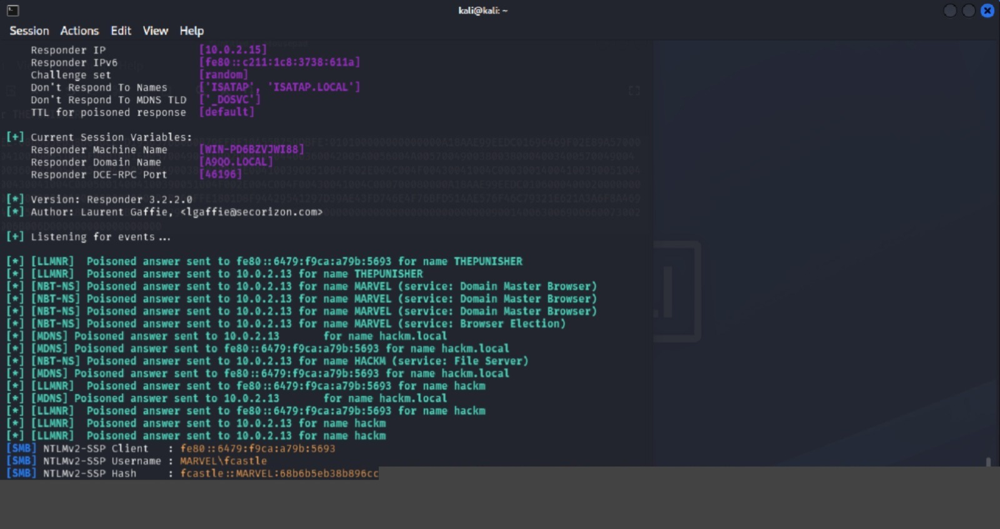

# LLMNR Poisoning

## Executive Summary

LLMNR poisoning is a network-based credential capture attack that abuses Windows name resolution behavior. In this lab, Responder was used from a Kali Linux attacker machine to answer LLMNR and NBT-NS requests from a Windows workstation. The attack successfully captured an NTLMv2 hash, which was then cracked using Hashcat.

The issue exists because Windows systems may use LLMNR or NBT-NS when DNS cannot resolve a requested hostname. If these protocols are enabled, an attacker on the same local network can respond to name resolution broadcasts and trick the victim into attempting authentication to the attacker-controlled system.

## Lab Environment

| Role | System | VM Name | Observed Details |
|---|---|---|---|
| Attacker | Kali Linux 2026.1 | kali-linux-2026.1-virtualbox-amd64 | Responder running on `eth0` |
| Domain Controller | Windows Server 2022 | Windows Server(AD) | Active Directory Domain Services |
| Victim Workstation | Windows 11 | THEPUNISHER | Domain joined client |
| Additional Workstation | Windows 11 | SPIDERMAN | Domain joined client |

Observed Responder output showed the lab domain as `MARVEL` and captured authentication activity from the `THEPUNISHER` workstation. Raw hashes and cracked passwords are intentionally not included in this report.

## Tools Used

- Responder
- Hashcat
- Kali Linux
- Windows Active Directory lab

## Attack Background

LLMNR, or Link-Local Multicast Name Resolution, allows Windows hosts to resolve names on the local network when DNS resolution fails. NBT-NS, or NetBIOS Name Service, provides similar legacy name resolution behavior.

This attack commonly occurs when a user or system attempts to access a hostname that does not exist in DNS. Instead of failing silently, the host may broadcast a name resolution request. An attacker listening on the same network can respond and claim to be the requested host. If the victim attempts to authenticate, the attacker can capture an NTLMv2 challenge-response hash.

## Conditions Required

This attack is possible when:

- The attacker is connected to the same local network segment as the victim.
- LLMNR or NBT-NS is enabled on Windows systems.
- A user or system attempts to resolve a hostname that DNS cannot resolve.
- The victim attempts to authenticate to the attacker-controlled response.

## Methodology

### Step 1: Start Responder

Responder was started on the Kali Linux attacker machine using the following command:

```bash
sudo responder -I eth0 -Pvd
```

Command option summary:

| Option | Purpose |
|---|---|
| `-I eth0` | Uses the `eth0` network interface |
| `-P` | Forces WPAD proxy authentication prompts where applicable |
| `-v` | Enables verbose output |
| `-d` | Enables DHCP poisoning mode |

### Step 2: Wait for Name Resolution Traffic

Responder listened for LLMNR, NBT-NS, and related broadcast traffic from Windows hosts on the lab network.

In the observed lab output, Responder sent poisoned responses for names such as `THEPUNISHER`, `MARVEL`, and invalid test hostnames. This confirmed that Windows hosts were using local broadcast name resolution.

### Step 3: Capture the NTLMv2 Hash

After a victim system attempted authentication, Responder captured an NTLMv2-SSP hash. The captured username was associated with the `MARVEL` domain.

The raw hash is not included in this report because credential material should not be published, even in lab documentation.

### Step 4: Crack the Captured Hash

Hashcat was used to crack the captured NTLMv2 hash with mode `5600`:

```bash
hashcat -m 5600 llmnr_Hashes.txt wordlist
```

Hashcat mode `5600` is used for NetNTLMv2 hashes.

## Evidence

The screenshot below shows Responder running in the Kali Linux attacker machine, sending poisoned LLMNR and NBT-NS responses, and capturing an NTLMv2-SSP authentication attempt from the `MARVEL` domain.




## Result

The LLMNR poisoning attack was successful in the lab environment.

Key outcomes:

- Responder successfully listened for LLMNR and NBT-NS traffic.
- A poisoned response was sent to a victim workstation.
- An NTLMv2 hash was captured.
- Hashcat successfully cracked the captured hash.

This demonstrates how weak or reused passwords can turn a network name resolution weakness into credential compromise.

## Risk

LLMNR and NBT-NS poisoning can allow an attacker with internal network access to capture password hashes without exploiting a software vulnerability. If the password is weak, reused, or present in a wordlist, the attacker may recover the plaintext password and use it for further domain access.

Potential impact includes:

- Domain credential exposure
- Lateral movement
- Unauthorized access to file shares or services
- Privilege escalation if the captured account has elevated rights

## Detection Opportunities

Defenders can look for the following indicators:

- Unexpected LLMNR or NBT-NS traffic on the network
- Multiple name resolution responses from non-server systems
- Use of tools such as Responder on internal subnets
- Authentication attempts to unusual hosts
- NTLM authentication where Kerberos would normally be expected
- Repeated failed or unusual SMB authentication events

Useful Windows event log areas include:

- Security logs for NTLM authentication activity
- SMB client and server events
- DNS client events
- Domain controller authentication logs

## Mitigation

The strongest mitigation is to disable LLMNR and NBT-NS across the environment.

### Disable LLMNR

Use Group Policy:

```text
Local Computer Policy > Computer Configuration > Administrative Templates > Network > DNS Client > Turn off Multicast Name Resolution
```

Set this policy to `Enabled`.

### Disable NBT-NS

Use the network adapter settings:

```text
Network Connections > Network Adapter Properties > TCP/IPv4 Properties > Advanced > WINS > Disable NetBIOS over TCP/IP
```

### Additional Controls

If the organization cannot fully disable LLMNR or NBT-NS, apply compensating controls:

- Require Network Access Control to limit unauthorized devices on internal networks.
- Enforce strong password requirements, preferably longer than 14 characters.
- Limit common words, predictable patterns, and reused passwords.
- Reduce or disable NTLM where possible.
- Monitor for LLMNR and NBT-NS poisoning behavior.

## Lessons Learned

This lab showed that default or legacy Windows name resolution behavior can expose credential material to an attacker on the same network. The attack did not require malware or exploitation of a missing patch. It depended on name resolution fallback behavior and password crackability.

From a defensive perspective, disabling unnecessary name resolution protocols and enforcing strong passwords significantly reduces the risk of successful credential compromise.

## References

- MITRE ATT&CK: Adversary-in-the-Middle, T1557
- MITRE ATT&CK: LLMNR/NBT-NS Poisoning and SMB Relay, T1557.001
- Responder project documentation
- Hashcat example hashes and mode reference
