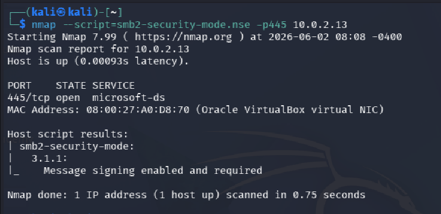
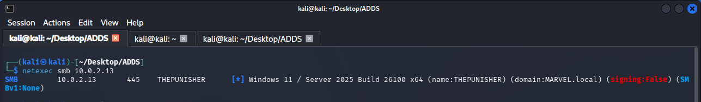
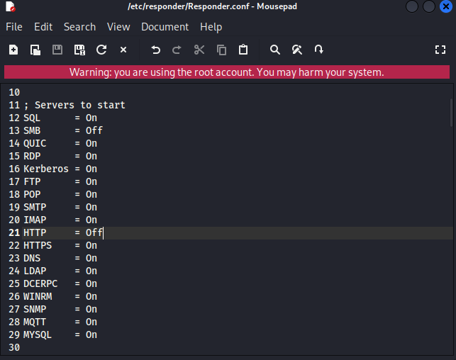
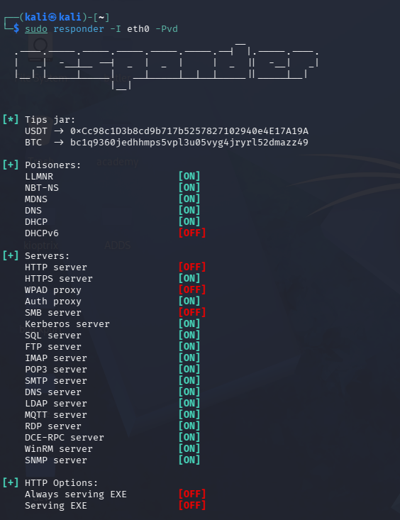
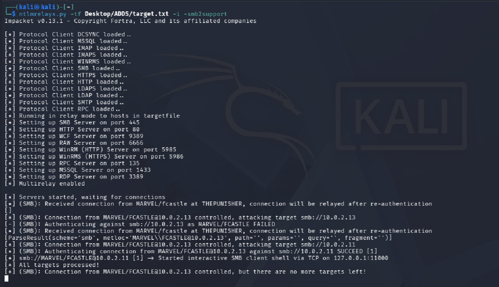
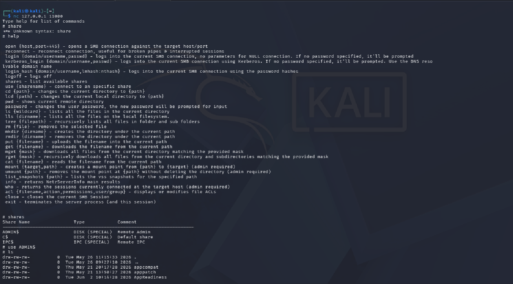

# SMB Relay Attack

## Executive Summary

SMB Relay is an authentication relay attack where an attacker captures an incoming NTLM authentication attempt and relays it to another host instead of cracking the hash offline. If the target host accepts NTLM authentication and does not require SMB signing, the attacker may gain access to that host using the relayed authentication context.

In this lab, SMB signing was checked with Nmap and NetExec. Responder was then configured with its SMB and HTTP servers turned off so captured authentication could be forwarded to Impacket `ntlmrelayx.py`. The relay successfully created an interactive SMB client shell against a target.

## Lab Environment

| Role | System | VM Name | Observed Details |
|---|---|---|---|
| Attacker | Kali Linux 2026.1 | kali-linux-2026.1-virtualbox-amd64 | Responder, NetExec, Nmap, Impacket |
| Domain Controller | Windows Server 2022 | Windows Server(AD) | Active Directory Domain Services |
| Workstation | Windows 11 | THEPUNISHER | SMB signing checked with Nmap and NetExec |
| Workstation | Windows 11 | SPIDERMAN | Domain joined client |

Observed lab domain: `MARVEL.local`.

## Tools Used

- Nmap
- NetExec
- Responder
- Impacket `ntlmrelayx.py`
- Netcat

## Attack Background

NTLM authentication can be relayed when a victim authenticates to an attacker-controlled listener and the attacker forwards that authentication to another network service. In an SMB Relay scenario, the attacker does not need to know or crack the user's password. The attacker reuses the authentication exchange in real time.

SMB signing helps prevent this attack by requiring SMB messages to be signed. If signing is not required, a relayed authentication attempt may be accepted by the target system.

## Conditions Required

This attack is possible when:

- The attacker is on the same network path as the victim authentication attempt.
- NTLM authentication is allowed.
- The relay target does not require SMB signing.
- The relayed user has useful permissions on the target system.
- Responder is configured so it does not consume the SMB or HTTP authentication before `ntlmrelayx.py` can relay it.

## Methodology

### Step 1: Identify SMB Signing Configuration with Nmap

Nmap was used to check SMB security mode:

```bash
nmap --script=smb2-security-mode.nse -p445 10.0.2.13
```

Evidence:



The Nmap evidence shows SMB message signing as enabled and required for the scanned host.

### Step 2: Confirm SMB Signing with NetExec

NetExec was used to validate SMB signing status:

```bash
netexec smb 10.0.2.13
```

The NetExec output identified the host as `THEPUNISHER` in the `MARVEL.local` domain and showed `signing:False`.

Evidence:



### Step 3: Disable SMB and HTTP in Responder

Responder was configured so it would poison name resolution traffic but would not start its own SMB or HTTP servers. This allows `ntlmrelayx.py` to receive and relay the authentication instead of Responder capturing it locally.

Configuration changes in `/etc/responder/Responder.conf`:

```text
SMB = Off
HTTP = Off
```

Evidence:



### Step 4: Start Responder

Responder was started on the attacker machine:

```bash
sudo responder -I eth0 -Pvd
```

Responder was used to poison LLMNR, NBT-NS, and related traffic while leaving SMB and HTTP handling available for the relay tool.

Evidence:



### Step 5: Start ntlmrelayx.py

Impacket `ntlmrelayx.py` was started with a target file and interactive mode:

```bash
ntlmrelayx.py -tf Desktop/ADDS/target.txt -i -smb2support
```

Command option summary:

| Option | Purpose |
|---|---|
| `-tf Desktop/ADDS/target.txt` | Uses a file containing relay targets |
| `-i` | Starts an interactive shell when relay succeeds |
| `-smb2support` | Enables SMB2 support |

The relay output showed an authentication attempt from `MARVEL/FCASTLE`. One relay attempt failed against `10.0.2.13`, while a relay to `10.0.2.11` succeeded and started an interactive SMB client shell on `127.0.0.1:11000`.

Evidence:



### Step 6: Connect to the Interactive SMB Shell

Netcat was used to connect to the interactive SMB client shell:

```bash
nc 127.0.0.1 11000
```

Inside the shell, the `shares` command showed available shares, including administrative shares such as `ADMIN$`, `C$`, and `IPC$`. The `ADMIN$` share was accessed and directory contents were listed.

Evidence:



## Result

The SMB Relay attack was successful in the lab environment.

Key outcomes:

- SMB signing was checked with Nmap and NetExec.
- Responder was configured with SMB and HTTP disabled.
- Responder was used to trigger and forward authentication activity.
- `ntlmrelayx.py` successfully relayed authentication to a target.
- An interactive SMB client shell was opened through `127.0.0.1:11000`.
- Administrative shares were visible through the relayed session.

## Risk

SMB Relay can allow an internal attacker to gain unauthorized access without cracking a password. If the relayed user has local administrator rights on the target, the attacker may be able to access administrative shares, execute commands, dump credentials, or move laterally.

Potential impact includes:

- Unauthorized access to SMB shares
- Lateral movement
- Remote command execution if privileges allow it
- Credential exposure
- Privilege escalation through misconfigured local administrator access

## Detection Opportunities

Defenders can look for the following indicators:

- Unexpected LLMNR, NBT-NS, or mDNS poisoning activity
- NTLM authentication to unusual systems
- SMB sessions from unexpected hosts
- Connections to administrative shares such as `ADMIN$` and `C$`
- Use of tools such as Responder or Impacket on internal networks
- Multiple SMB authentication attempts across several hosts
- NTLM authentication where Kerberos would normally be expected

## Mitigation

### Enable SMB Signing on All Devices

SMB signing should be required on servers and workstations wherever possible.

| Pros | Cons |
|---|---|
| Completely stops SMB Relay attacks against signed SMB targets. | Can cause performance issues with file copies, especially in older or resource-constrained environments. |

### Disable NTLM Authentication on the Network

Reducing or disabling NTLM forces systems to use stronger authentication methods such as Kerberos where possible.

| Pros | Cons |
|---|---|
| Completely stops NTLM relay paths when NTLM is blocked. | If Kerberos stops working or is misconfigured, Windows environments may attempt to fall back to NTLM unless fallback is also controlled. |

### Account Tiering

Account tiering limits where privileged accounts can log on. For example, domain administrator accounts should only be used on systems that require domain administrator access.

| Pros | Cons |
|---|---|
| Limits exposure of privileged accounts and reduces the impact of relayed authentication. | Enforcing the policy may be difficult and requires planning, monitoring, and user discipline. |

### Local Administrator Restrictions

Restricting local administrator access reduces the usefulness of a relayed account on workstations and servers.

| Pros | Cons |
|---|---|
| Can prevent a large amount of lateral movement. | May increase service desk tickets if administrative workflows are not planned properly. |

### Additional Controls

- Disable LLMNR and NBT-NS where possible.
- Enforce least privilege for local administrator access.
- Use Local Administrator Password Solution or Windows LAPS.
- Monitor and restrict NTLM usage.
- Segment networks to reduce relay opportunities.
- Require Network Access Control to limit unauthorized internal devices.

## Lessons Learned

This lab showed that SMB Relay can be more immediately impactful than offline hash cracking because the attacker can reuse authentication in real time. The most important defensive control is requiring SMB signing, followed by reducing NTLM usage and limiting where privileged accounts can authenticate.

SMB Relay is most dangerous when multiple weaknesses exist together: name resolution poisoning, NTLM authentication, SMB signing not required, and users with excessive local administrator privileges.

## References

- MITRE ATT&CK: Adversary-in-the-Middle, T1557
- MITRE ATT&CK: LLMNR/NBT-NS Poisoning and SMB Relay, T1557.001
- Impacket `ntlmrelayx.py`
- NetExec documentation
- Microsoft documentation for SMB signing and NTLM restrictions
