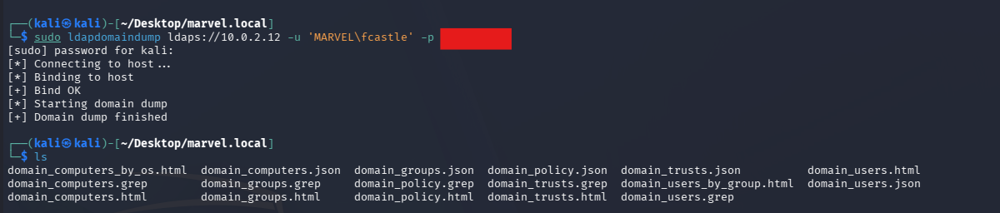
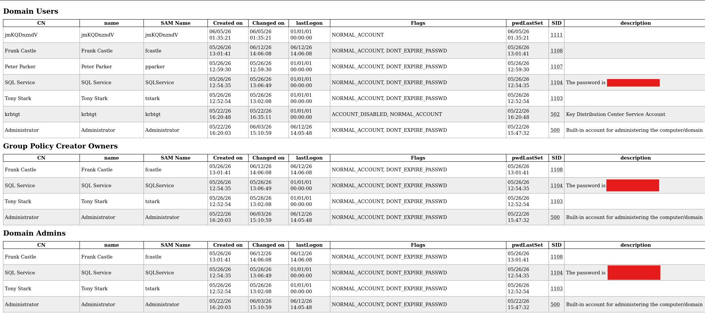
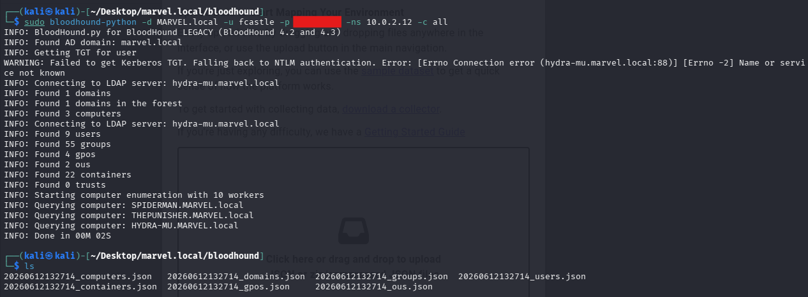
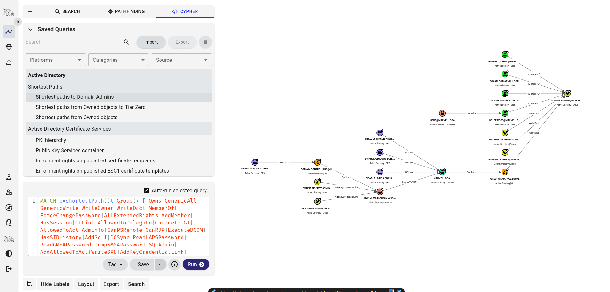
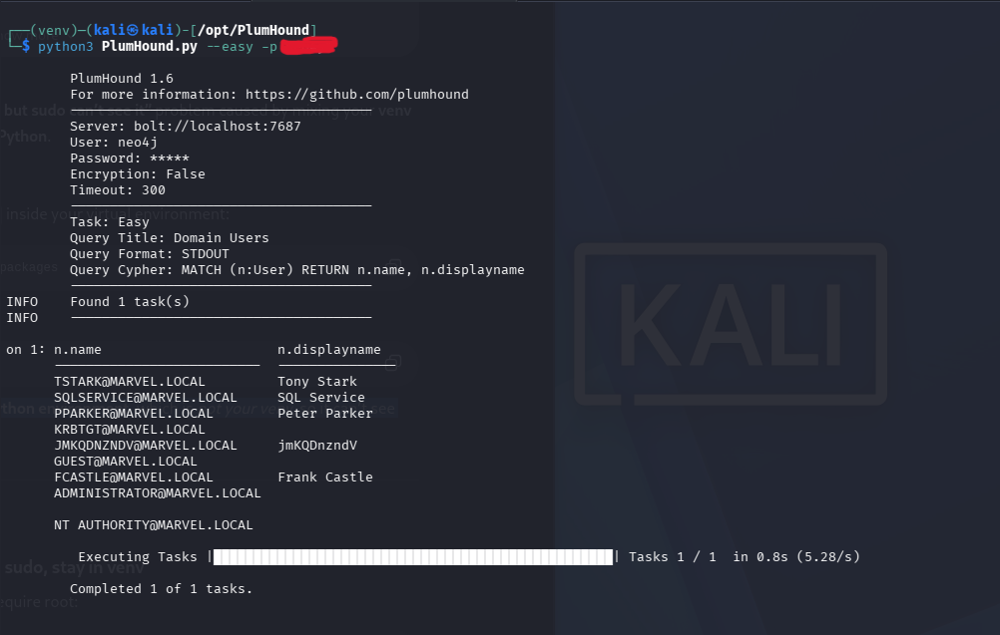
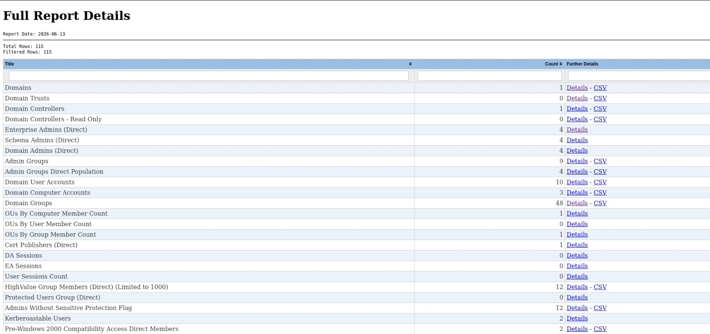

# Post-Compromise Enumeration

Post-compromise enumeration is the process of mapping users, groups, computers, permissions, sessions, policies, and attack paths after gaining valid domain access. The goal is to understand what the compromised account can see, what it can reach, and where privilege escalation opportunities may exist.

## Lab Setup Note

This lab uses a small Active Directory environment, so some tool output is limited compared to a real enterprise domain. The smaller output is expected and still useful for learning how each tool collects, organizes, and presents domain information.

## ldapdomaindump

**Purpose:** Dump readable LDAP domain data into HTML, JSON, and grep-friendly files.

### Install and Run

```bash
sudo apt update
sudo apt install -y ldapdomaindump
```

```bash
mkdir -p ~/Desktop/marvel.local/ldapdomaindump
cd ~/Desktop/marvel.local/ldapdomaindump
sudo ldapdomaindump ldaps://10.0.2.12 -u 'MARVEL\fcastle' -p '<REDACTED_PASSWORD>'
```

### Screenshot





### What It Pulls

ldapdomaindump pulls LDAP information such as domain users, groups, computers, group membership, policies, trusts, and useful account attributes. It writes the results into files such as `domain_users.html`, `domain_users_by_group.html`, `domain_computers.html`, and matching JSON or grep outputs.

### What the Output Reveals

The output gives a quick offline view of domain structure and account relationships. In this small lab, the results are minimal, but they still show users, groups, privileged memberships, computer accounts, and risky account descriptions that should not contain passwords.

### Attacker and Defender Use

An attacker uses ldapdomaindump to quickly identify privileged users, interesting groups, service accounts, and weak documentation habits such as passwords stored in descriptions. A defender can use the same output to audit Active Directory hygiene, review group membership, and find exposed sensitive information.

## BloodHound

**Purpose:** Collect and visualize Active Directory relationships to identify privilege escalation and attack paths.

### Install and Run

```bash
sudo apt update
sudo apt install -y bloodhound bloodhound.py neo4j
```

```bash
sudo neo4j console
```

```bash
sudo bloodhound-start
```

```bash
mkdir -p ~/Desktop/marvel.local/bloodhound
cd ~/Desktop/marvel.local/bloodhound
sudo bloodhound-python -d MARVEL.local -u fcastle -p '<REDACTED_PASSWORD>' -ns 10.0.2.12 -c all
```

After collection, upload the generated JSON files into the BloodHound interface.

### Screenshot





### What It Pulls

BloodHound collects users, groups, computers, group memberships, sessions, ACLs, GPO links, local admin rights, delegation data, and other relationships. In this lab, the collector found a small dataset, including 1 domain, 3 computers, 9 users, 55 groups, 4 GPOs, 2 OUs, 22 containers, and 0 trusts.

### What the Output Reveals

BloodHound turns domain relationships into a graph so attack paths are easier to see. In this small lab, the shortest path and group relationship output is limited, but it still shows how users, groups, computers, and policies connect to privileged objects.

### Attacker and Defender Use

An attacker uses BloodHound to find practical paths to Domain Admins, Tier Zero systems, or other high-value targets. A defender uses it to identify excessive privileges, dangerous ACLs, nested group risk, delegation issues, and misconfigured relationships before they are abused.

## PlumHound

**Purpose:** Generate BloodHound-based reports and queries in a cleaner report format.

### Install and Run

```bash
sudo apt update
sudo apt install -y git python3-venv python3-pip
```

```bash
cd /opt
sudo git clone https://github.com/PlumHound/PlumHound.git
sudo chown -R kali:kali /opt/PlumHound
cd /opt/PlumHound
python3 -m venv venv
source venv/bin/activate
pip install -r requirements.txt
```

```bash
python3 PlumHound.py --easy -p '<BLOODHOUND_PASSWORD>'
```

```bash
python3 PlumHound.py -x tasks/default.tasks -p '<BLOODHOUND_PASSWORD>'
```

### Screenshot





### What It Pulls

PlumHound does not collect directly from the domain. It queries the BloodHound Neo4j database and turns the existing graph data into task output, HTML reports, CSV files, and summary views.

### What the Output Reveals

The output highlights domain counts, administrative groups, user and computer accounts, sessions, Kerberoastable users, protected users, and other BloodHound-derived findings. Because the lab domain is small, many report categories have low counts or no results, which is expected.

### Attacker and Defender Use

An attacker uses PlumHound to quickly summarize BloodHound findings and prioritize paths without manually clicking through the graph. A defender uses it for repeatable reporting, review notes, and comparison of Active Directory risk over time.

## Key Takeaways

| Tool | Best Use | Output Style | When to Use |
|---|---|---|---|
| ldapdomaindump | Fast LDAP inventory | HTML, JSON, grep files | Use first for a quick domain snapshot and offline review. |
| BloodHound | Relationship and path analysis | Graph database and GUI | Use when you need to understand privilege paths and object relationships. |
| PlumHound | BloodHound reporting | HTML, CSV, query output | Use after BloodHound ingestion to generate structured reports and summaries. |

In a small lab, ldapdomaindump is useful for readable domain tables, BloodHound is best for visualizing relationships, and PlumHound is best for turning BloodHound data into repeatable reports.
