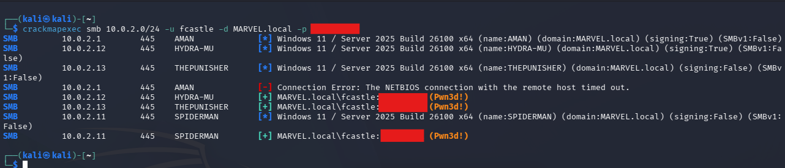
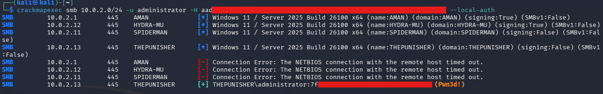
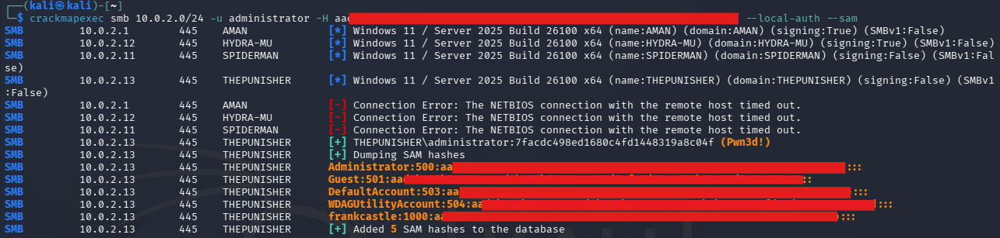
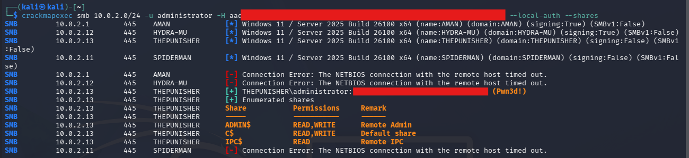
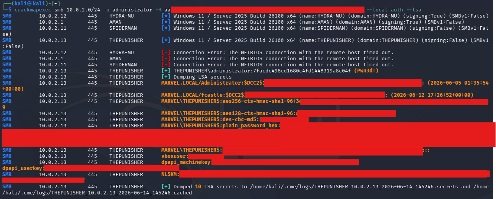
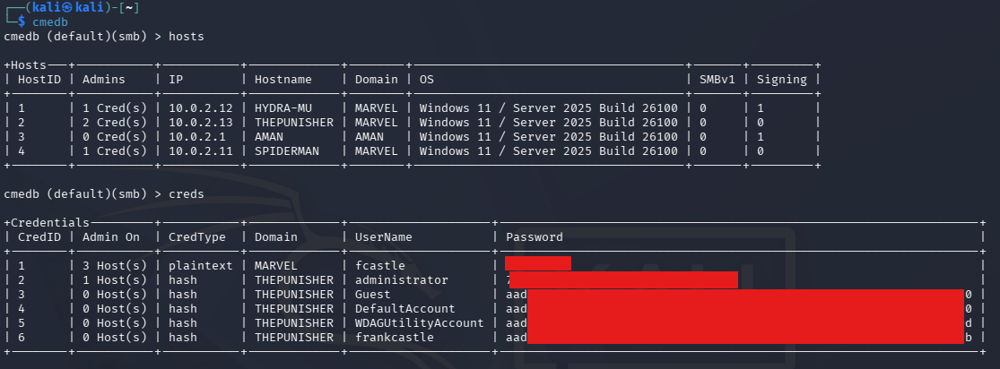
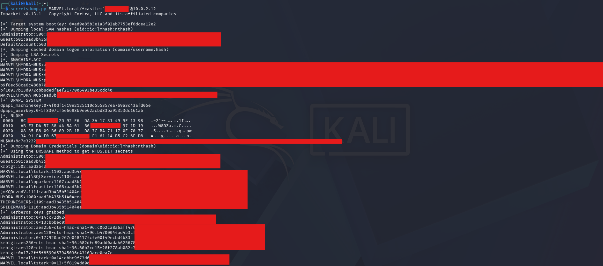

# Post-Compromise Attacks

This section documents attacks performed after valid credentials or hashes have already been obtained. At this stage the focus shifts from initial access to proving what an attacker can do with existing access.

## Pass Attacks

Pass attacks allow an attacker to authenticate without knowing or typing the original plaintext password every time. In this lab I tested both pass-the-password and pass-the-hash techniques against the MARVEL domain using CrackMapExec and Impacket.

These screenshots show lab activity only. Passwords and hashes are redacted and should not be published in raw form.

## Lab Environment

| Role | Host | Notes |
|---|---|---|
| Domain | MARVEL.local | Active Directory lab domain |
| Domain Controller | HYDRA-MU | Domain controller target |
| Workstation | THEPUNISHER | Local administrator hash was used successfully |
| Workstation | SPIDERMAN | Workstation discovered during SMB testing |
| Attacker | Kali Linux | CrackMapExec and Impacket tooling |

## Tools Used

- CrackMapExec
- CME database
- Impacket `secretsdump.py`

## Attack Background

Pass-the-password uses a valid username and plaintext password to authenticate across multiple systems. Pass-the-hash uses an NTLM hash instead of the plaintext password, which means the attacker can authenticate even if the original password is never recovered.

These attacks work when the same local administrator password or reusable credential material exists across systems. They are especially useful after credential dumping, password cracking, or local administrator compromise.

## Methodology

### Step 1: Validate Credentials Across SMB

The first step was to test known domain credentials against SMB across the lab subnet.

```bash
crackmapexec smb 10.0.2.0/24 -u fcastle -d MARVEL.local -p '<REDACTED_PASSWORD>'
```

Evidence:



The output confirmed that the `fcastle` credential was valid in the MARVEL domain. Some hosts showed successful authentication while other attempts timed out, which is expected in a small lab with mixed host availability.

### Step 2: Perform Pass-the-Hash with a Local Administrator Hash

Next, a local administrator hash was tested with CrackMapExec using local authentication.

```bash
crackmapexec smb 10.0.2.0/24 -u administrator -H '<REDACTED_NTLM_HASH>' --local-auth
```

Evidence:



The output showed that the hash worked against `THEPUNISHER` as the local administrator account. This proved that the NTLM hash could be used directly for authentication without the plaintext password.

### Step 3: Dump SAM Hashes

After confirming local administrator access, SAM hashes were dumped from the target.

```bash
crackmapexec smb 10.0.2.0/24 -u administrator -H '<REDACTED_NTLM_HASH>' --local-auth --sam
```

Evidence:



The output showed local account hashes from `THEPUNISHER`, including built-in and local user accounts. These hashes can help an attacker look for reused passwords, local admin reuse, and additional authentication paths.

### Step 4: Enumerate SMB Shares

The same hash was used to enumerate available SMB shares.

```bash
crackmapexec smb 10.0.2.0/24 -u administrator -H '<REDACTED_NTLM_HASH>' --local-auth --shares
```

Evidence:



The output showed access to administrative shares such as `ADMIN$`, `C$`, and `IPC$` on `THEPUNISHER`. This confirmed that the account had meaningful local administrative access on the target.

### Step 5: Dump LSA Secrets

The local administrator hash was then used to dump LSA secrets.

```bash
crackmapexec smb 10.0.2.0/24 -u administrator -H '<REDACTED_NTLM_HASH>' --local-auth --lsa
```

Evidence:



The output contained cached secrets and credential material from the target. This type of output can expose service account material, cached domain logons, machine account secrets, and other sensitive values.

### Step 6: Review Stored Results in the CME Database

CrackMapExec stored discovered hosts and credentials in its local database.

```bash
cmedb
```

```text
cmedb (default)(smb) > hosts
cmedb (default)(smb) > creds
```

Evidence:



The database made it easier to review discovered hosts, admin access, credential types, and which systems each credential worked against. This is helpful for tracking access during a post-compromise workflow.

### Step 7: Use secretsdump.py with a Password

Finally, Impacket `secretsdump.py` was used against the domain controller with valid credentials.

```bash
secretsdump.py MARVEL.local/fcastle:'<REDACTED_PASSWORD>'@10.0.2.12
```

Evidence:



The output showed local SAM data, cached domain logon information, LSA secrets, and domain credential material from the target. This confirms why valid credentials after compromise can quickly lead to broader credential exposure.

## Result

The pass attacks were successful in the lab.

Key outcomes:

- Domain credentials were validated across SMB.
- A local administrator NTLM hash was used successfully with pass-the-hash.
- SAM hashes were dumped from `THEPUNISHER`.
- SMB shares were enumerated with local administrator access.
- LSA secrets were dumped from the target.
- CME database output showed discovered hosts and stored credentials.
- `secretsdump.py` extracted credential material from the domain controller using valid credentials.

## Risk

Pass attacks are dangerous because they let attackers reuse credential material without needing to know the plaintext password. If local administrator passwords are reused, one compromised hash can become access to many systems.

The risk increases when privileged accounts log on to workstations, when local admin passwords are shared across hosts, or when defenders do not monitor SMB authentication and credential dumping activity.

## Detection Opportunities

Defenders can look for:

- SMB authentication attempts across many hosts.
- Local administrator logons from unusual systems.
- Authentication using NTLM where Kerberos is expected.
- Access to administrative shares such as `ADMIN$` and `C$`.
- SAM, LSA, or NTDS dumping behavior.
- New or unusual use of tools that behave like CrackMapExec or Impacket.
- Event logs showing remote logons, service creation, or credential access.

Useful Windows event IDs include:

- `4624` for successful logons.
- `4625` for failed logons.
- `4672` for special privileges assigned to a new logon.
- `7045` for service creation.
- `4662` for directory service object access when auditing is enabled.

## Mitigation

Pass attacks are hard to completely prevent, but the goal is to make them much harder to perform.

### Limit Account Reuse

- Avoid reusing local administrator passwords across machines.
- Disable Guest and unnecessary Administrator accounts.
- Limit who is a local administrator.
- Follow least privilege for all workstation and server access.

### Use Strong Passwords

- Use long passwords, preferably longer than 14 characters.
- Avoid common words and predictable patterns.
- Prefer passphrases that are long and unique.

### Use Privileged Access Management

- Check out sensitive accounts only when needed.
- Rotate passwords automatically after check out and check in.
- Reduce the lifetime of useful passwords and hashes.
- Limit pass attacks by constantly rotating privileged credential material.

### Additional Controls

- Deploy Windows LAPS for local administrator password rotation.
- Restrict NTLM where possible.
- Prevent privileged accounts from logging on to standard workstations.
- Monitor administrative share access.
- Alert on credential dumping behavior.
- Use endpoint protection to detect tools and behaviors linked to credential theft.

## Lessons Learned

This lab showed that passwords and hashes can both be useful after compromise. A plaintext password helped validate domain access, while an NTLM hash was enough to authenticate as local administrator and dump additional secrets.

The main lesson is that credential reuse makes post-compromise activity much easier. Strong password hygiene, unique local administrator passwords, PAM, and careful monitoring all reduce the impact of pass attacks.
